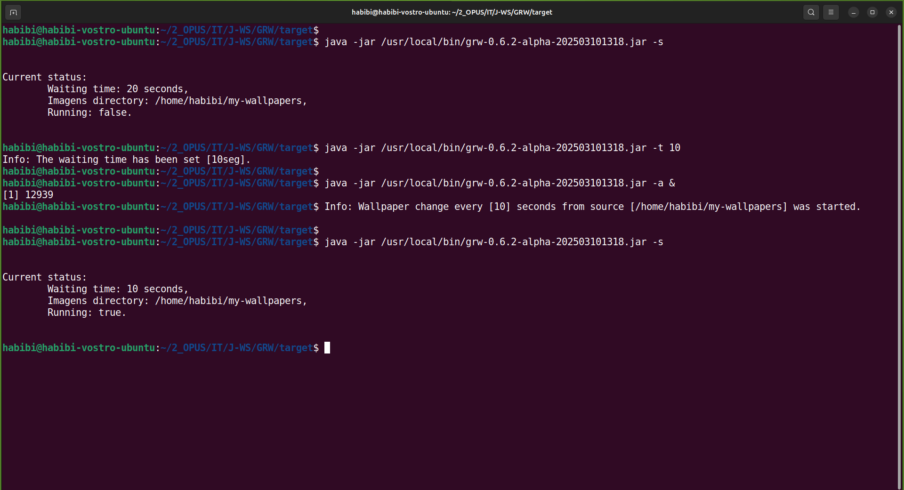
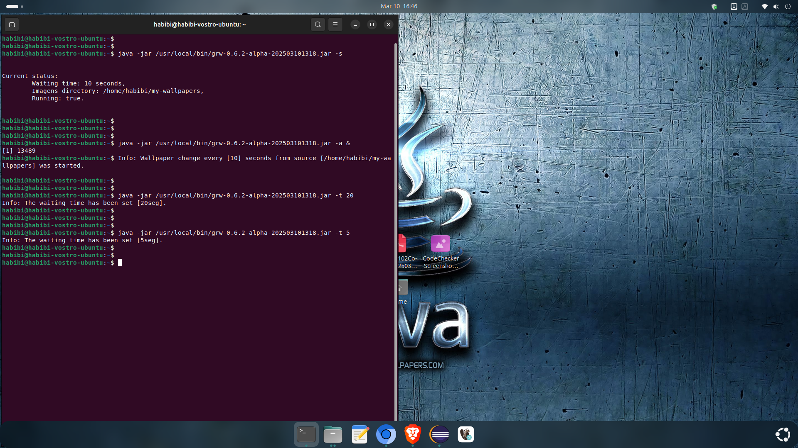
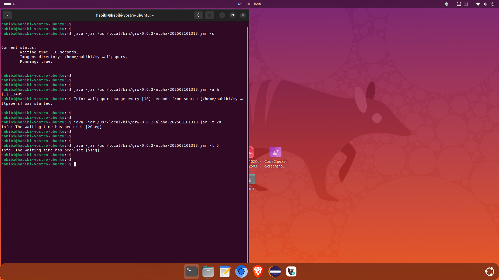

# GRW
Gnome Randomic Wallpaper  
_(dev.ropimasi.grw)_  

&nbsp;  
&nbsp;  
&nbsp;  

## LIST OF CONTENTS
* [Attention: Rights, License and Disclaimer](#attention-rights)
* [Description](#description)
* [Description - Screenshots](#description-screenshots)
* [Versioning Guideline](#versioning)
* [Features](#features)
* [Instructions](#instructions)
* [Author](#author)  

&nbsp;  
&nbsp;  
&nbsp;  

## ATTENTION: RIGHTS, LICENSE AND DISCLAIMER:
>**IMPORTANT NOTE / DISCLAIMER:** (en-US)
>This is a personal, private project, exclusively for the purposes of my studies in software development; This project and its resources are an integral, indivisible, inseparable part of a private project, which has its use expressly exclusive to its author, Ronaldo Silva (ropimasi@email.com / http://ropimasi.dev); Any use, sale, rental, distribution, in part or in full of this project is prohibited; It is a project under development and experimentation, therefore I do not recognize or assume any responsibility for its use, nor for any possible reflections or consequences of such use.
>   
>**NOTA IMPORTANTE / ISENÇÃO DE RESPONSABILIDADE:** (pt-BR)
>Este é um projeto pessoal, privado, exclusivamente para fins dos meus estudos em desenvolvimento de software; Este projeto e seus recursos são parte integrante, indivisível, indissociável de um projeto privado, que tem seu uso expressamente exclusivo ao seu autor, Ronaldo Silva (ropimasi@email.com / http://ropimasi.dev); É proibida qualquer utilização, venda, locação, distribuição, parcial ou integral deste projeto; É um projeto em desenvolvimento e experimentação, portanto não reconheço ou assumo qualquer responsabilidade pelo seu uso, nem por quaisquer possíveis reflexos ou consequências de tal uso.  

&nbsp;  
&nbsp;  
&nbsp;  

## DESCRIPTION
* SUBJECT: Java application to change the wallpaper of Gnome Desktop Environment;
* PROJECT NAME: **GRW**;
* WHAT IS: **GRW** is a small software aims to change the wallpaper image of Gnome Desktop randomly. Developed for Linux with Gnome Desktop Environment. More information about versions and compatibility can be found below;
* TO WIT: The **GRW** and its resources are a project sample, which I have developing to demonstrate some of my abilities. The **GRW** project belongs to my personal portfolio. Its detailed project can be followed just here on GitHub: [github.com/users/ROPIMASI/projects/](https://github.com/users/ROPIMASI/projects/). It is also found on my web-portfolio: [ropimasi.dev/portfolio](https://ropimasi.dev/portfolio).  

&nbsp;  
&nbsp;  
&nbsp;  

### DESCRIPTION - SCREENSHOTS
##### CLI- Command Line interface:  

&nbsp;  

##### Desktop:  

&nbsp;  
&nbsp;  
&nbsp;  

## VERSIONING GUIDELINE
In a team project, it is very important to know and follow the specifications of the project version. This project is designed under [**_SemVer_** (Semantic Versioning Specification)](http://semver.org/).  
Thus, this project uses **_SemVer_** for its versioning. **_SemVer_** is a specification (set of rules) that tells us (or dictates) how to use the numbers (and some letters) on the _versioning-expression_ (_VerExpr_).  

See more details about the versioning for this project in [readme-pages/versioning.md](readme-pages/versioning.md).

&nbsp;  
&nbsp;  
&nbsp;  

## FEATURES
### Features in current version (0.6.3)
  + Prints syntax and brief option help to the screen;
  + Prints the current version of _*GRW*_ to the screen;
  + Prints the current status of the configuration set to the screen;
  + Sets the timeout for automatically changing the wallpaper;
  + Sets a directory as the image directory;
  + Starts the infinite loop for image changing;
  + Stops the infinite loop for image changing;  
  + Recover the default value for waiting time and images directory configuration;

&nbsp;  

### Features in target release version (1.0.0)
  + Sets all configurations as default value;
  + Use 'n' different image directories along their aliases;

&nbsp;  
&nbsp;  
&nbsp;  

## INSTRUCTIONS
### Instalation
* Put the _APP_ file (`grw-x.y.z.jar`) in directory `/usr/local/bin/` (example: `/usr/local/bin/grw-x.y.z.jar`;  
* Create the auto start file `grw.desktop` in `/home/.config/autostart/` (example: `/home/.config/autostart/grw.desktop`). See the file content below;  
* The GRW config file `grw.yaml` will be created automaticly by the _APP_ in `/home/.config/grw/grw.yaml`;  
* A GRW images folder `/home/my-wallpapers/` will be created automaticly by the _APP_ in `/home/`;  

> **`grw.desktop` file content:**  
>  
> [Desktop Entry]  
> Type=Application  
> Name[en_US]=grw.desktop  
> Name=grw.desktop  
> Comment[en_US]=Gnome Randomic Wallpaper  
> Comment=Gnome Randomic Wallpaper  
> Exec=java -jar /usr/local/bin/grw-0.6.2-alpha-202503101318.jar -a &  
> X-GNOME-Autostart-enabled=true  

&nbsp;  

### Usage
//TODO:

&nbsp;  
&nbsp;  
&nbsp;  

## Att. Ronaldo Silva.
##### | [https://ropimasi.github.io](https://ropimasi.github.io) | [linkedin @ropimasi](https://linkedin.com/in/ropimasi/) | [x (twitter) @ropimasi](https://x.com/ropimasi/) | [instagram @ropimasi](https://instagram.com/ropimasi/) | [ropimasi@email.com](mailto://ropimasi@email.com) |  

&nbsp;  
&nbsp;  
&nbsp;  
  